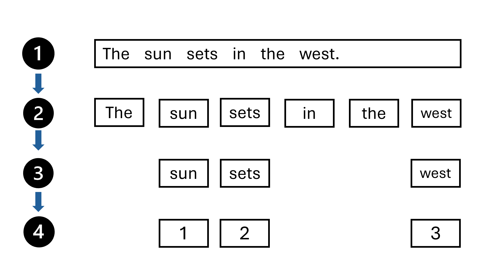
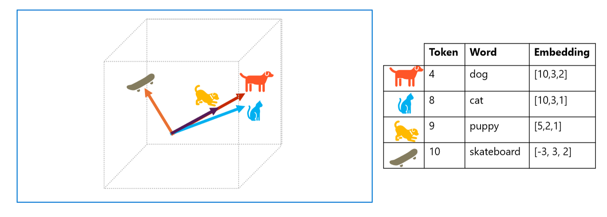

Over the last decades, multiple developments in the field of **natural language processing** (**NLP**) have resulted in achieving **large language models** (**LLMs**). The development and availability of language models led to new ways to interact with applications and systems, such as through generative AI assistants and agents.

Let's take a look back at historical developments for language models which include:

- **Tokenization**: enabling machines to *read*.
- **Word embeddings**: enabling machines to capture the relationship between words. 
- **Architectural developments**: (changes in the design of language models) enabling them to capture word context.  

## Tokenization

As you may expect, machines have a hard time deciphering text as they mostly rely on numbers. To *read* text, we therefore need to convert the presented text to numbers.

One important development to allow machines to more easily work with text has been tokenization. **Tokens** are strings with a known meaning, usually representing a word. **Tokenization** is turning words into tokens, which are then converted to numbers. A statistical approach to tokenization is by using a pipeline:




1. Start with the text you want to **tokenize**.
1. **Split** the words in the text based on a rule. For example, split the words where there's a white space.
1. **Stop word removal**. Remove noisy words that have little meaning like `the` and `a`. A dictionary of these words is provided to structurally remove them from the text.
1. **Assign a number** to each unique token.

Tokenization allowed for text to be labeled. As a result, statistical techniques could be used to let computers find patterns in the data instead of applying rule-based models.

## Word embeddings

One of the key concepts introduced by applying deep learning techniques to NLP is **word embeddings**. Word embeddings address the problem of not being able to define the **semantic relationship** between words.

Word embeddings are created during the deep learning model training process. During training, the model analyzes the cooccurrence patterns of words in sentences and learns to represent them as **vectors**. A vector represents a path through a point in n-dimensional space (in other words, a line). Semantic relationships are defined by how similar the angles of the lines are (i.e. the direction of the path). Because word embeddings represent words in a vector space, the relationship between words can be easily described and calculated.

To create a vocabulary that encapsulates semantic relationships between the tokens, we define contextual vectors, known as embeddings, for them. Vectors are multi-valued numeric representations of information, for example [10, 3, 1] in which each numeric element represents a particular attribute of the information. For language tokens, each element of a token's vector represents some semantic attribute of the token. The specific categories for the elements of the vectors in a language model are determined during training based on how commonly words are used together or in similar contexts.
 
Vectors represent lines in multidimensional space, describing direction and distance along multiple axes (you can impress your mathematician friends by calling these amplitude and magnitude). Overall, the vector describes the direction and distance of the path from origin to end.



The elements of the tokens in the embeddings space each represent some semantic attribute of the token, so that semantically similar tokens should result in vectors that have a similar orientation – in other words they point in the same direction. A technique called cosine similarity is used to determine if two vectors have similar directions (regardless of distance), and therefore represent semantically linked words. For example, the embedding vectors for "dog" and "puppy" describe a path along an almost identical direction, which is also fairly similar to the direction for "cat". The embedding vector for "skateboard" however describes journey in a very different direction.

## Architectural developments 

The architecture, or design, of a machine learning model describes the structure and organization of its various components and processes. It defines how data is processed, how models are trained and evaluated, and how predictions are generated. One of the first breakthroughs in language model architecture was the **Recurrent Neural Networks** (**RNNs**). 

To understand text isn't just to understand individual words, presented in isolation. Words can differ in their meaning depending on the **context** they're presented in. In other words, the sentence around a word matters to the meaning of the word. 

RNNs are able to take into account the context of words through multiple sequential steps. Each step takes an **input** and a **hidden state**. Imagine the input at each step to be a new word. Each step also produces an **output**. The hidden state can serve as a memory of the network, storing the output of the previous step and passing it as input to the next step. 

Imagine a sentence like:

```Vincent Van Gogh was a painter most known for creating stunning and emotionally expressive artworks, including ...```

To know what word comes next, you need to remember the name of the painter. The sentence needs to be completed, as the last word is still *missing*. A missing or **masked** word in NLP tasks is often represented with `[MASK]`. By using the special `[MASK]` token in a sentence, you can let a language model know it needs to predict what the missing token or value is.

Simplifying the example sentence, you can provide the following input to an RNN: `Vincent was a painter known for [MASK]`:


The RNN takes each token as an input, processes it, and updates the hidden state with a memory of that token. When the next token is processed as new input, the hidden state from the previous step is updated.

Finally, the last token is presented as input to the model, namely the `[MASK]` token. Indicating that there's information missing and the model needs to predict its value. The RNN then uses the hidden state to predict that the output should be something like `Starry Night`


#### Challenges with RNNs

In the example, the hidden state contains the information `Vincent`, `is`, `painter`, and `know`. With RNNs, each of these tokens are equally important in the hidden state, and therefore equally considered when predicting the output.

RNNs allow for context to be included when deciphering the meaning of a word in relation to the complete sentence. However, as the hidden state of an RNN is updated with each token, the actual relevant information, or **signal**, may be lost.

In the example provided, Vincent Van Gogh's name is at the start of the sentence, while the mask is at the end. At the final step, when the mask is presented as input, the hidden state may contain a large amount of information that is irrelevant for predicting the mask's output. Since the hidden state has a limited size, the relevant information may even be deleted to make room for new and more recent information.

When we read this sentence, we know that only certain words are essential to predict the last word. An RNN however, includes all (relevant and irrelevant) information in a hidden state. As a result, the relevant information may become a *weak signal* in the hidden state, meaning that it can be overlooked because there's too much other irrelevant information influencing the model.

So far, we described how language models can read text through *tokenization* and how they can understand the relationship between words through *word embeddings*. We also explored how past language models tried to capture the context of words. Next, learn how the limitations of previous models are handled in today's language models with transformer architecture. 